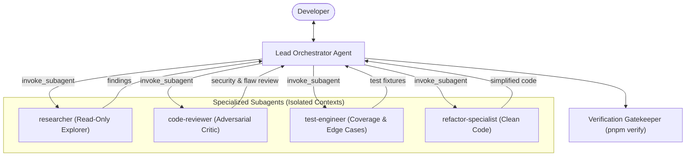

# Multi-Agent (Subagent + Orchestrator) Protocol

This rule governs the design, invocation, and coordination of multi-agent workflows within this repository.

---

## 1. The Orchestrator-Worker Architecture

### Lead Orchestrator Responsibilities:
1. **Context Guardian**: Shields the main session context from massive logs, sprawling docs, or repetitive exploratory reads by delegating discovery to `researcher`.
2. **Decomposer**: Splits complex features into atomic sub-tasks with unambiguous interface contracts.
3. **Adversarial Gate**: Submits proposed code diffs to `code-reviewer` before presenting them to the human.
4. **VCS Governor**: Maintains exclusive control over git commits, ensuring zero unauthorized commits and strict conventional commit formats.

---

## 2. Specialized Subagent Roster

| Subagent Role | Type / Mode | Capabilities & Tools | When to Invoke |
| :--- | :--- | :--- | :--- |
| **Researcher** | Read-Only | `view_file`, `grep_search`, `read_url_content`, `search_web` | Surveying large libraries, examining third-party API docs, finding code patterns across large codebases. |
| **Adversarial Critic** | Reviewer | Read-only tools + diff analysis | Reviewing diffs for security, edge-case nullability, hydration bugs, and performance bottlenecks. |
| **Test Engineer** | Full / Write | Read + Write + Test runner | Generating test suites, boundary tests, and mock fixtures. |
| **Refactor Specialist**| Full / Write | Read + Write + Verify | Pruning dead code, enforcing single-responsibility principles, and simplifying complex schemas. |

---

## 3. Orchestration Workflows

### A. Parallel Fan-Out / Fan-In
When an epic contains independent research or test-writing tracks:
1. Orchestrator invokes subagents concurrently in a single `invoke_subagent` tool call.
2. Subagents execute in parallel in their own background processes.
3. As messages arrive reactively, Orchestrator merges insights and executes the implementation.

### B. Isolated Workspaces (`branch` / `share`)
- When testing experimental architectural refactors, dispatch subagents with `Workspace: 'branch'`.
- The subagent tests the hypothesis in an isolated git workspace without risking current working state.
- Once verified via `pnpm verify`, the orchestrator transfers the solution to the main tree.

### C. Inter-Agent Communication Protocol
- Use `send_message` to guide subagents or request revisions.
- Provide subagents with clear acceptance criteria and explicit constraints.
